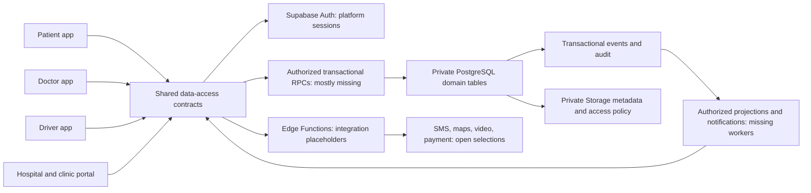
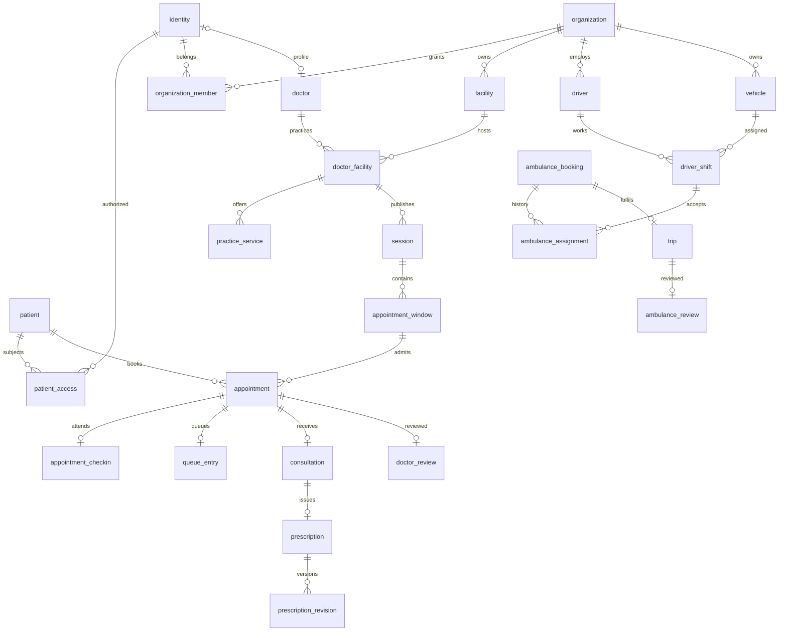
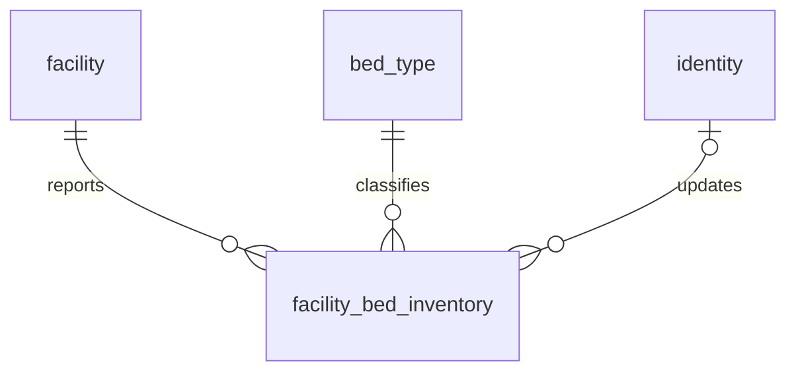
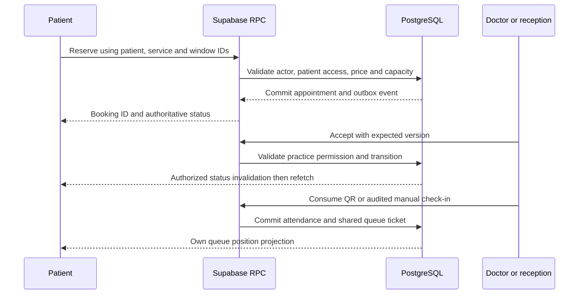

# Architecture, ownership and relationships

Confirmed scope and evidence are in README.md. Diagrams distinguish deployed foundations from required additions; arrows specify ownership, not proof of an implemented connection.

## Application architecture

The web portal is tenant-scoped. The deferred platform console is not a superuser role in the current client. Creating a clinic creates an owner of that new tenant, not platform authority. A doctor-owner performs approvals/check-in/queue operations without requiring a separate staff employee. No clinic is required to create bed inventory.

## One source of truth

| Data                                                    | Owner                                          | Canonical source                                          | Consumer rule                                                              |
| ------------------------------------------------------- | ---------------------------------------------- | --------------------------------------------------------- | -------------------------------------------------------------------------- |
| Credentials/verified phone/session                      | Auth provider                                  | Supabase Auth; domain identity reference                  | Never trust user_metadata role or a typed contact as verification          |
| Patient demographics/dependents                         | Patient/authorized guardian                    | patient + patient_access                                  | Authorized projections; emergency contact is not a delegate                |
| Doctor declaration                                      | Doctor                                         | doctor, languages, specialties, credential evidence       | Verification status controlled by authorized reviewer                      |
| Facility name/address/practices                         | Facility owner/admin                           | organization, facility, doctor_facility                   | Doctor selects affiliation; cannot rename someone else's hospital          |
| Consultation fees and schedule                          | Authorized practice manager/doctor             | practice_service + versioned rules/sessions               | Snapshot accepted fee and effective service mode on appointment            |
| Booking and queue lifecycle                             | Transactional command layer                    | appointment/check-in/queue/consultation                   | Client requests action; cannot set status or completion freely             |
| Clinical findings/prescription                          | Authorized clinician                           | signed notes, diagnoses, observations, immutable revision | Corrections append; reception gets operational subset only                 |
| Bed inventory                                           | Facility operations                            | Aggregate facility/type counts + observation time         | Available/occupancy calculated; stale data labeled; no admission guarantee |
| Driver/vehicle credentials                              | Driver/operator submits, reviewer verifies     | driver/vehicle/capabilities + evidence/reviews needed     | Declaration never enables dispatch by itself                               |
| GPS                                                     | Driver device input validated by server        | latest location + sampled trip_location                   | Limited to active authorized trip; ETA from provider                       |
| Dispatch assignment                                     | System transaction                             | offers/assignment/trip                                    | Exactly one active accepted assignment, histories preserved                |
| Fare/payment                                            | Pricing policy and verified collector/provider | quote/payment/refund/provider_event                       | Fare, collection, driver earnings and payouts are distinct                 |
| UI filter/tab/search draft/modal                        | Current client                                 | React/local state or URL                                  | Do not add database columns                                                |
| Distance/age/experience/rating/queue position/occupancy | Calculated                                     | Canonical facts + query time/location                     | No independently editable copies                                           |

## Validated cardinalities

| Relationship                | Correct shape                                              | UI consequence                                                                     |
| --------------------------- | ---------------------------------------------------------- | ---------------------------------------------------------------------------------- |
| Doctor ↔ facility           | N:M through doctor_facility                                | Practice selector; pricing and schedules scoped to affiliation                     |
| Doctor ↔ specialization     | N:M through doctor_specialty                               | Multi-select controlled taxonomy                                                   |
| Doctor ↔ language           | 1:N codes (effectively N:M with language vocabulary)       | Multi-select; do not copy comma-separated labels                                   |
| Practice ↔ availability     | 1:N rules/sessions; sessions 1:N windows                   | Versioned dates/timezone/breaks/exceptions                                         |
| Facility ↔ department       | Required 1:N when roster/departments ship; absent baseline | Separate department management; do not relabel bed types as departments            |
| Facility ↔ bed type         | N:M through aggregate inventory                            | Optional inventory per facility; no per-bed admissions in chosen scope             |
| Patient ↔ appointment       | 1:N; patient_access N:M identities                         | Family selection uses authorized patient IDs                                       |
| Doctor ↔ appointment        | 1:N through session                                        | Clinician assignment derived consistently; no conflicting copied FK                |
| Appointment ↔ window        | N:1; window may hold many patients                         | Slot selection is an arrival window, not necessarily one exclusive bed/appointment |
| Driver ↔ vehicle            | N:M over time through shifts                               | One active shift per driver and vehicle, preserve historical assignments           |
| Ambulance request ↔ patient | N:1 nullable for guest SOS                                 | Guest has limited capability; account claim is explicit                            |
| Review ↔ appointment/trip   | At most 1 per completed appointment/trip                   | Validate participation/completion and duplicate submission                         |
| Facility ↔ ambulance        | Not modeled as direct ownership                            | Organization owns vehicles; facility staging/assignment is OPEN until needed       |
| Identity ↔ roles            | Multiple profiles and scoped memberships                   | One account may be patient, doctor and clinic owner                                |

## Core ERD (existing foundation)

## Confirmed aggregate inventory addition

`available = total - occupied - maintenance`; all counts nonnegative and occupied+maintenance ≤ total. Keep observation time distinct from generic row update time. Update with expected row version, authorize facility scope, and create an audit/event in the same transaction. Published patient read must include observation time and clarify this is reported inventory, not a reservation. Freshness threshold and ER acceptance are separate policies.

## Cross-app booking contract

This sequence is the required implementation contract. The current demo routes do not implement it.
